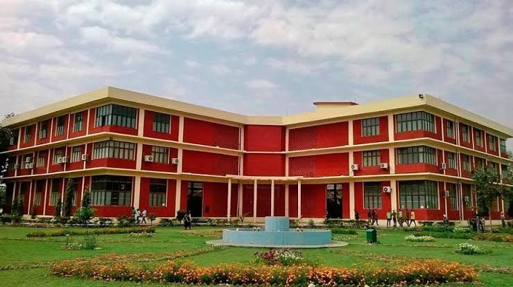

# MY EXPERIENCE AT GNDEC 

### __- Day 1 (10th July,2024)__ 

> INDUCTION PROGRAM DAY

My day started with a sleepless night. I woke up at 7:am and started getting dressed up. I went from my home at 8:15am and reached at exactly 8:50am. Then, I waited to meet someone I know earlier. But unfortunately I got no one. So. then, I went to a [hall](https://www.facebook.com/photo.php?fbid=888709246633124&set=pb.100064821697496.-2207520000&type=3) where the kirtan and ardas was going to held. i took off my shoes and washed my hands. Then, I covered my head and moved inside the hall. The kirtan and ardas made me feel so good and relaxing.

It made me feel that I didn't choose this but Waheguru Ji had chosen it for me. So, with a brave heart and strong mind I attended it and came outside the hall after it ended. Then I took the refreshments offered by the college which were really good. Then, I met my one friend who was in my class during 11th-12th in my [school](https://www.google.com/search?q=bvm+kithclu+nagar&rlz=1C1CHBF_enIN1051IN1051&oq=bvm+kithclu+nagar&gs_lcrp=EgZjaHJvbWUyBggAEEUYOTISCAEQLhgNGK8BGMcBGIAEGI4FMgkIAhAAGA0YgAQyCQgDEAAYDRiABDIICAQQABgWGB4yDQgFEAAYhgMYgAQYigUyDQgGEAAYhgMYgAQYigUyDQgHEAAYhgMYgAQYigUyCggIEAAYgAQYogTSAQg3NjMwajBqNKgCALACAA&sourceid=chrome&ie=UTF-8). After meeting him, I went to the [Auditorium](https://gndec.ac.in/cultural/?q=node/9). Before entering the auditorium, I got a file bag, which was for all students. In the bag, There was brochure about the college, an invitation letter for me, a pen and a notepad. I took it and went inside the auditorium.

The auditorium was very calm, pleasent and was creatively structured. Then, all teachers and seniors came up there. After it, Our respected Principle sir, [Dr. Sehijpal Singh Guru](https://fb.watch/tigo5j7WBQ/), Our Director sir, [NSET S.Inderpal Singh](https://fb.watch/tigpSmuCit/) along with our alumna [Er.Jiwandeep Singh](https://fb.watch/tigjZwZe3z/), PCS officer, came there to greet and interact with all of us. First, Our principal sir came and motivated us to make the best use of this platform. Then, Our director sir introduced us to the legendry and illustrious history of this [instituion](https://www.gndec.ac.in/), emphasizing its 100 years of shaping brilliant minds. He highlighted the first 36 years, which were dedicated in the establishment of this [instituion](https://www.gndec.ac.in/).

Then, our one of the alumni, now as a PCS officer, who was the "Guest Of Honor" of that day, illustrated us the imporatnce of "what", "how" and most imporant "My why". One of the great question which we all should ask from ourselves at the beginning of anything so that we can properly, carefully, whole heartedly and with a great self-confidence do the task we want to do. he explained us the real meaning of an __"ENGINEER"__ that is _creators_. As a creator, an engineer creates various things to solve a problem in very quick and creative way.\
He also made us feel about how significant is an _oppurtunity_.

He took out a 500 rupee note and ask all of us that whosever want that note can come forward and take the note with him/her. A boy raised his hand and came forward and took it and rest of us were shocked to see it. Then, sir illustrated that every oppurtunity, whether it is small or large, we should grab it on time. we all should be prepared for any kind of oppurtunity.\
Then one more alumna, [S.Rajeshwar Singh Sidhu](https://fb.watch/tigzIRdD9R/), SSP, Interacted with all of us with his wonderful experiences and stories. He emphasised the imporatnce of how GOD took test of all us and give us reward according to it throughout our life. He make us to feel it and told us to just keep your focus on yourself and keep improving yourself.

Then, the [Day 2 Of INDUCTION PROGRAM](https://fb.watch/tigAJvY2Z7/) got over.

<!--FRom here code is being edited-->

___

### __- Day 2 (11th July, 2024)__

> INDUCTION PROGRAM DAY 

The day began with a sleepful night as I was tired and I went to college. I went to the same [Auditorium](https://gndec.ac.in/cultural/?q=node/9) and took a seat. The program started with [Mr. Arvind Dhingra](https://gndec.ac.in/faculty/?id=68) sir, head of the Technical activities, pass out of [NIT JAIPUR](https://www.google.com/search?sca_esv=1af7de384805fe35&sca_upv=1&rlz=1C1CHBF_enIN1051IN1051&sxsrf=ADLYWIJRj8lU4wRCnhGTHBoZ1MBjn_64qg:1720950747389&q=NIT+JAIPUR&source=lnms&fbs=AEQNm0BKxFXqFZETuC92mLOmXO9xJMdcEc6vsS8xotR_o6JIE2lxJVbfbQf0QBF0bvfl3GFNBPTQACMdFh6XPuV1Z0Eg9hjj1mCoiKv3FGCZSoL8LFWndMdM2XR4aGD0cSNlCtcWfG2Uxx1VHbESZZGtTLqJIpWorIEiBwoLHBotrxsca8c17DXljhODP05SZ-xKH05k1jwUlGV8PNmYih-FkegBBuFe9w&sa=X&ved=2ahUKEwimlOWPoaaHAxV7SGcHHTklAhkQ0pQJegQIFBAB&biw=1536&bih=730&dpr=1.25). He explained about how life is all about changing and growing and how will we all can transform. He said it could be done by ["I"](https://media.istockphoto.com/photos/fire-letter-on-black-background-picture-id531734101?k=6&m=531734101&s=612x612&w=0&h=TwtdHdTjv6wlWWFJcOV4lsd3aZiKcupxh_Qy04TLNOE=), which means by changing our mindset and perspective, we all can change and grow. He said that the best song of the world is our own heartbeat and start this college journey with [GNDEC](https://gndec.ac.in/) with a "YES" instead of a "NO" and have faith on this [institution](https://gndec.ac.in/).

He said that everyone is already good in their respective domains but we should try to be a great one and for that we should invest our time in extra curricular along with the regular curricular. He said, invest your time, instead of wasting it. __And, by listening to this from sir, I decided to be a legendry who can be great in anything whether it is academics, sports or any other thing__.

Then, sir talked about stage fear and called some of the students to break their fear and convert it into confidence and a skill. 

Then, sir introduced us about " Who is a Member", there are four types:
>- MEMBER
>- ACTIVE MEMBER
>- EXECUTIVE MEMBER
>- OFFICE BEARER

Then, he breifed us about the various socities:
>- SCIE 
>- ISTE
>- E2S2
>- SAE
>- ISHRAE
>- AMPE
>- ASME 
>- CSI
>- DATA SCIENCE CLUB
>- IETE
>- PFA
>- PARWAY CLUB
>- CAUSMIC CLUB
>- LINE WIRE CLUB
>- ENGLISH CLUB
>- E-CELL & IIC\
> __and so on......__

Then, he breifed about some of the competitons:
>- HACK@GNE 3.0
>- IDEATHON
>- CREATIVELO CHALLENGE 
>- SOLAR VEHICLE

Then, at last, he ended the session by emphasising us about __"3P's of Life"__
>- Passion'
>- Persistence
>- Patience

After this session, One sir came and breifed us about the college, faculties, student council, scholarship and various more things.

Then came a turning point for me and some of more students like me. [Dr. Hardeep Singh Rai](https://gndec.ac.in/faculty/?id=268),  The controller of examination, came to mentor all of us.First, he surveyed about how we all think about examinations in just one or two words. I wrote " Challenge and Motivation", i am saying this honestly because by these two words I got strength to overcome the fear of it. His perspective, strategies and vision on examinations was fascinating and inspirational.

After, ending sessiion, he proposed all of us that they are giving a chance to 10 students to get mentored under him and get complete guidence about coding. Without any doubt, I went forward to sir to get this oppurtunity. But more that 50 students wanted to be a part of it. So, sir decided to make Telegram group and I entered the group. Sir gave us a task which was to make portfolio using markdown, which I partially completed at that time but now I have done it.
And, by taking this goal, I came home and dedicatedly started doing it. I learned markdown and started making the project but I was unable to make my project live at Github pages. But, I sent a pdf format of my work. Then, my day ended and I was ready for the next day as my first day as classes was going to happen.    

___

### __- Day 3 (12th July 2024)__

> CLASSES DAY

The day began with the same routine and I went to college. Today, students have to attend their classes for the first time. Everyone checked their schedule which was sent it on Whatsapp group earlier. I reached outside the auditorium and 
went to the stairs side. I reached at first floor and then started finding my classroom. It was a very long corridor. Then, I found the classroom where my first lecture was going to held. The first lectures was taken by our seniors. In rhe lecture, they enlighten us about Chatgpt and Excel. Majorly, the Lecture was on Excel. They teached us variuos things about it, new functions about which I was also not aware earlier. Then after finishing, it they as our friend said that if we got in any trouble related to college or studies, we can contact them, ask them and get a solution from them.

I personely really enjoyed it. Then, I went for my second lecture which was of mathematics, my faourite one. There I meet a faculty of mahtematics, [Mr. Sanchit Mehra](https://gndec.ac.in/faculty/?id=401), assistant professor, applied sciences department. He was very good, cooperative adn humorous. He, introduced, himself and then ask to tell our names individually. Then, after introductuion process, he started teaching about derivatives. Then, the class got over.

Then, I went to a [canteen](https://www.instagram.com/p/CGc3dWkghg9/?utm_source=ig_web_copy_link) for lunch. After lunch, there was a breifing class of [Rai sir](https://gndec.ac.in/faculty/?id=268). There he breifed us about how can we upload our file to Github and make a live link of it. I got a very good chance to correct my mistakes. Also, sir mentioned that however my task was not fully completed but my efforts were good enough. This made me feel so good and I decided that, by hook or crook, I will complete it. Then, finally, I completed it.

##### LEARNING 1 :-

Learning from all this is not too much, but it simply says that, all the goals, aims, tasks, everything depends only and only on us. It depends how much dedicated we are for it, how much discplined, how much hunger is present and most imporatantly the "WHY". So, from this experience, you all can have learning ofone word which is:

__SELF-DISCIPLINE and SELF-CONFIDENCE__

____

### __- Day 4 (15th July, 2024)__

> INDUCTION PROGRAM DAY
 
The day began with a fear of fever as I was suffering from cough and cold but still made up my mind ready to go to college whatever it takes. So, today was again our "INDUCTION PROGRAM". 

The day started with the lecture of [Dr. Randhir Singh](https://gndec.ac.in/faculty/?id=75) sir, associate professor, breifed us about the major tasks which we all students have to do. He said that all the students must have to give Profficiency Test of English, Profficiency Test of Mathematics, Report making about your experience at GNDEC and INDUCTION PROGRAM and a E-certificate about any skill. These all tasks are useless for some people, but from my perspective, these all things can uplift are potential in a very good way. He also instructed us about the [Github pages](https://github.com/) and how to make repositry on it in detail. he also mentioned about [MARKDOWN](https://www.markdownguide.org/cheat-sheet/).

Then, [Dr. Pyare Lal Garg](https://scontent.fixc4-3.fna.fbcdn.net/v/t39.30808-6/451339540_892343842936331_7545701491075788439_n.jpg?_nc_cat=104&ccb=1-7&_nc_sid=833d8c&_nc_ohc=8irMyC9G028Q7kNvgFXxJrs&_nc_ht=scontent.fixc4-3.fna&oh=00_AYB0uMxa-9PYgXIuqZlQtUKXCEATVnM00v-o79LKP5BB4g&oe=66A1C343), adviser to Punjab Congress president Navjot Singh Sidhu. Garg, 73, who retired as professor of paediatric surgery in 2002 and is known for his outspoken nature, has worked both with the Shiromani Akali Dal-Bharatiya Janata Party (SAD-BJP) as well as Congress governments in Punjab.

First, He greeted everyone with good wishes and blessings, also feel grateful to GNDEC and faculty members of the college for giving him the oppurtunity to speak in GNDEC college amongst the students. Seeing the students, he reminded his old days and said about teaching which was full of togetherness in his time. Many new changes have been implemented in the world but human behaviour is still same and ability and power of attaining courage to be great , not just to be good or average. 

__He said that the tantrums, bad things and bad thoughts of people about us was in their time also which makes him to question his integrity. He mentioned that we all are same as all others both at mentally and physically but the thing which is the differentiater is the change we implant both in ourselve and in surroundings. By saying that now he will going to give us a piece of his all learnings, he started to resist his old stories which were inspirational and motivational.__ 

He said that teacher is just like a _diya_ which means the teachers overcomes many problems in order to enlighten the students, many times a teacher sacrifices something, due to which the status of a teacher rises up very high in everyone's eye. But no one realises it now, but in future we are able to relate it with us. The teachings we got from the teachers is not a favour on students but blessings given by our respected teachers. We all got this as inheritance.Also, Teachers are responsible to give students the required teachings on time.

 __He also illustrated that just like trees which do not eat their own fruits, rivers and lakes which cannot drink it's own water, in the same way teachers teachings are for students not for their own use.So, we all must respect it.__

He said that we should not get afraid of new things, rather get strengthen by doing them. Inner strength and powers has so much power that the external problems are nothing infront of it. He said that this college knows everything, So we can fully trust all the teachers and members of this college. He said that this college is way more different from the other government colleges.

 He said that if a new students came up to him, whether he knows something or not, he will see that what he knows and how he respond to other things. Everyone fears first, maybe less or more, but humans have power to be strong in any conditions.

 __He also mentioned about the "NEET SCAM" problem which is really disheartening problem because the students who tried their best got nothing which makes their kills their confidence and faith. He said the servicesgiven by the NTA is wrong and we all have to improve them. He mentioned their are many oppurtunities, so we have to be ready in advance in order to grab them. Eveyone fails, got stressed, experience anxiety and depression but still they manage, do efforts and achieve what they want to.__

_Many people come in our life, some of which came to demotivate us, make us feel low and some came to help us, guide us, become our well-wishers, support us. That's why, we should never look whose gone but to look on whose still up there for you_

Many stories, teachings and many more things sir gave us by this speech which means a lot to me.

Our next speaker of the day was, [Mr. Sony Goyal](https://www.missioncat.in/assets/img/others/sonygoyal.jpg), have done engineering 1997-2004, which was 7 years of experience, renowned as the favourite [CAT](https://www.google.com/search?q=cat+full+form&sca_esv=e59d9031b627fbb2&sca_upv=1&rlz=1C1CHBF_enIN1051IN1051&sxsrf=ADLYWIKhpk0dmi4Vf6Dz4fe-dxt9REvwvg%3A1721144232690&ei=qJOWZuDzKZ-8seMPzNe28AY&oq=CAT&gs_lp=Egxnd3Mtd2l6LXNlcnAiA0NBVCoCCAAyChAAGLADGNYEGEcyChAAGLADGNYEGEcyChAAGLADGNYEGEcyChAAGLADGNYEGEcyChAAGLADGNYEGEcyChAAGLADGNYEGEcyChAAGLADGNYEGEcyChAAGLADGNYEGEcyDRAAGIAEGLADGEMYigUyDRAAGIAEGLADGEMYigUyDRAAGIAEGLADGEMYigUyDRAAGIAEGLADGEMYigUyDhAAGLADGOQCGNYE2AEBMg4QABiwAxjkAhjWBNgBATIOEAAYsAMY5AIY1gTYAQEyExAuGIAEGLADGEMYyAMYigXYAQIyExAuGIAEGLADGEMYyAMYigXYAQIyExAuGIAEGLADGEMYyAMYigXYAQIyExAuGIAEGLADGEMYyAMYigXYAQJIpQtQAFgAcAF4AZABAJgBAKABAKoBALgBAcgBAJgCAaACCpgDAIgGAZAGE7oGBggBEAEYCboGBggCEAEYCJIHATGgBwA&sclient=gws-wiz-serp) educator on youtube. He brings over 15 years of experience to help you to crack [CAT](https://www.google.com/search?q=cat+full+form&sca_esv=e59d9031b627fbb2&sca_upv=1&rlz=1C1CHBF_enIN1051IN1051&sxsrf=ADLYWIKhpk0dmi4Vf6Dz4fe-dxt9REvwvg%3A1721144232690&ei=qJOWZuDzKZ-8seMPzNe28AY&oq=CAT&gs_lp=Egxnd3Mtd2l6LXNlcnAiA0NBVCoCCAAyChAAGLADGNYEGEcyChAAGLADGNYEGEcyChAAGLADGNYEGEcyChAAGLADGNYEGEcyChAAGLADGNYEGEcyChAAGLADGNYEGEcyChAAGLADGNYEGEcyChAAGLADGNYEGEcyDRAAGIAEGLADGEMYigUyDRAAGIAEGLADGEMYigUyDRAAGIAEGLADGEMYigUyDRAAGIAEGLADGEMYigUyDhAAGLADGOQCGNYE2AEBMg4QABiwAxjkAhjWBNgBATIOEAAYsAMY5AIY1gTYAQEyExAuGIAEGLADGEMYyAMYigXYAQIyExAuGIAEGLADGEMYyAMYigXYAQIyExAuGIAEGLADGEMYyAMYigXYAQIyExAuGIAEGLADGEMYyAMYigXYAQJIpQtQAFgAcAF4AZABAJgBAKABAKoBALgBAcgBAJgCAaACCpgDAIgGAZAGE7oGBggBEAEYCboGBggCEAEYCJIHATGgBwA&sclient=gws-wiz-serp) secure spot in the top [IIMs](https://www.google.com/search?q=IIM&sca_esv=e59d9031b627fbb2&sca_upv=1&rlz=1C1CHBF_enIN1051IN1051&sxsrf=ADLYWIKdUjKJL6yFQBghrRZ_0isqZXYCLQ%3A1721144236926&ei=rJOWZvajOLinseMPs8CN0AE&ved=0ahUKEwj2qeX28auHAxW4U2wGHTNgAxoQ4dUDCA8&uact=5&oq=IIM&gs_lp=Egxnd3Mtd2l6LXNlcnAiA0lJTTISEAAYgAQYsQMYQxiKBRhGGPsBMgoQABiABBhDGIoFMgoQABiABBhDGIoFMggQLhiABBixAzINEAAYgAQYsQMYQxiKBTINEAAYgAQYsQMYQxiKBTIKEAAYgAQYQxiKBTIKEAAYgAQYQxiKBTIKEAAYgAQYQxiKBTINEAAYgAQYsQMYQxiKBTIeEAAYgAQYsQMYQxiKBRhGGPsBGJcFGIwFGN0E2AECSI0qUOMGWLgncAJ4AZABA5gB3AGgAYULqgEFMC43LjK4AQPIAQD4AQGYAgagAuoFqAIUwgIKEAAYsAMY1gQYR8ICDRAAGIAEGLADGEMYigXCAgUQABiABMICChAAGIAEGAIYywHCAgcQIxgnGOoCwgITEAAYgAQYQxi0AhiKBRjqAtgBAcICChAjGIAEGCcYigXCAg8QABiABBhDGIoFGEYY-wHCAhAQABiABBixAxhDGIMBGIoFwgIbEAAYgAQYQxiKBRhGGPsBGJcFGIwFGN0E2AECmAMJiAYBkAYKugYGCAEQARgBugYGCAIQARgTkgcFMi4yLjKgB55Y&sclient=gws-wiz-serp). He mentioned a word __"JOSH"__ which means according to him was __"Journey To Success Highway"__.
He came up with a mantra for us which was " 1 2 Ka 4", which seemed really interesting. He started by saying that your success decides on your inner stregth. Give your 100% to everything. He also said that while giving your introduction about high school, instead of saying Non-medical, say Science stream. 

He said that students must study with full focus, interest adn dedication. The 2nd _mantra_ he mentioned was " Love what you do, Do what you love", he meant by this that everything we do, we should do not only with logic but also with seriousness. He said that mind workes at it's highest peak is when it is relaxed not when it is stressed out from the problems. He also suggested that students must play everyday for about 30-45 min, outside games, in order to keep ourselves physically upto-date and get our mind in relax mode. 

Then, he mentioned about how we should work in these 4 years by reminding this _mantra_, that is :

>- __L__ EARN
>- __I__ NQUIRE
>- __F__ UTURE
>- __E__ XPLORE

Which combines into __"LIFE"__. He also mentioned about __"SEA"__, that is:

>- __S__ COPE
>- __E__ VALUTION
>- __A__ WARENESS
  
  He said that India has the greater and valuable youth which have immense powers to do anything. He said that everyone can do everything but what they can do individually, no one can do it in the same way you do.

  He suggested to just enjoy and explore but participate in any hobby, do live projects and grow your network. In the race between success and excellence, always excellence wins, That is why, we all should focus on excellence, not only on success. He also mentioned about a life cycle of a student.

| __1__ | __Birth__ |
|:---:|:-------------:|
| __2__ | __LKG-UKG__ |
| __3__ | __1st-5th__ |
| __4__ | __10th-12th__ |
| __5__ | __Graduation / PG / PHD__ |
| __6__ | __First Job + Career__ |
| __7__ | __Next Generation / Retired life__ |
| __8__ | __Death__ |

And these steps are in a cycle and are continuous. He also mentioned some of the successful persons 
- [Prabhjeet Singh](https://www.linkedin.com/in/prabhjeetsingh1/?original_referer=https%3A%2F%2Fwww%2Egoogle%2Ecom%2F&originalSubdomain=in)
- [Ashneer Grover](https://www.instagram.com/ashneer.grover/)
 
  and some more...

At the end, He said that with passion and courage, we are able to define our destiny and dreams. Dreams come true to those who dare to dream. 

Then, our senior, currently in 4th year, [Pancham Jai Singh Gill](https://www.facebook.com/photo.php?fbid=892343002936415&set=pb.100064821697496.-2207520000&type=3), Ex-NCC cadet, mentor of causmic club, one of the best NCC shooters, came to enlighten us through his experiences. He started with a quotation of Peter Drucker :

<!-- add image of peter ducker -->

He also illustrated about Non-verbal communication and body language. "It's what you don't say that", this line describes that not only our verbal skill matters but also non verbal skills are required. He mentioned a statistic acording to which 7% words, 38% voice tone, manipulation, pulses and __55% body movements, face, arms, other body parts play a vital and important role in communication skills.__ 

Then, He taught us how we can predicte that when someone is smiling, it is a real smile or fake smile, which was remarkable observation by human kind. He also mentioned about __Seven Universal Expressions :__

>- Sadness
>- Surprise 
>- Happiness
>- Fear
>- Anger
>- Disgust
>- Contempt

He also taught us about handshakes. He said that there different types of handshakes which will tell the other person how you are responding to the conversation. There are many types of handshakes such as: 

>- Sweaty palms
>- Dead fish
>- Brush off
>- The Two handed handshake
>- Controller
>- Finger Vice 
>- Bone Crusher
>- Lobster Claw
>- The Top-Handed Shake
>- The Pusher\
> __And so on....__

He also mentioned about __"Steepling Hands"__. The steepling hand gesture is a very common gesture that is often used to convey confidence, authority, or knowledge. It is also a very popular gesture for public speakers and politicians. The steepling hand gesture is done by placing the fingertips of both hands together in front of the chest with the fingers pointing upward. He also mentioned thumd displays and 4 leg lock postions.  

<!-- Only the above para contains content from google-->

These all things helped to us learn various parameters about non verbal communication. And, in the end, He said that Engineering is a fear-fighting thing, So we should not deal it as a problem but as a challenge to grow and improve.

_____

### __- Day 5 (16th July, 2024)__

> Quiz Day 

Our daily schedule was sent by the teachers which was about a hall event, but it was in the afternoon. So, I slept well and prepared for the college. But, before it, there was a discussion class of mine with H S Rai sir. After it ends, I went towards the hall but I checked my phone and our schedule got changed. So, I went to classes according to the new schedule. 

And it was glad to know that it was a quiz competition at class level on aptitude. The quiz was really great and fun. I was consists of many sports related, author names related and a lot more. 

After that, there was a quiz based on English knowledge which was beyond my knowledge, which is why I was not able to participate properly but I enjoyed. 

___

### __- Day 6 (17th July, 2024)__

> CLASSES DAY 

Today, there was one maths class and one UHV class. So, I woke up early as usual and went to college. The first class, which was of maths, was taken by [Sanchit sir](https://gndec.ac.in/faculty/?id=401), in the [seminar hall](https://gndec.ac.in/gallery/_data/i/upload/2020/10/18/20201018210155-e852507a-la.jpg). The seminar hall was well organised room and had good and comfortable furniture for the students. 

Sir taught us about integration. First, we recalled about basics of it and then practiced some questions on variuos types of integrations. 

Then, our first lecture of UHV (Universal Human Values), taken by [Rishi Kapoor sir](https://gndec.ac.in/faculty/?id=403), assistent professor. 

He introduced this subject first that what is UHV and how it is important. Then, He started the first topic which was "Human values/ Education/ Professional ethics. Then, He briefed us about how to answer a question of 10-15 marks.
He also taught us "Understanding tha Harmony in family" and also about "Aspiration".

Then, there was a briefing class of [Hardeep sir](https://gndec.ac.in/faculty/?id=268). After attending it, I went home.

___

### __- Day 7(18th July, 2024)__
  
> CLASSES AND INDUCTION PROGRAM DAY

Today, There were both classes and induction program was going to held. So, as usual, I woke up and went to college. 

First section of day was in classes. The first lecture was of UHV by [Rishi sir](https://www.gndec.ac.in/faculty/?id=403). He taught us about:
>- Understanding the Human Being
>- Briefing About "Self Body"
>- Activities Of Self Body
>- Response Of Self And Body
>- Gross Misunderstanding
>- Understanding Harmony In Self 
>- State Of Imagination

Then, there was our peer interaction of __"CANVA"__.
Canva is a free graphic design platform that's great for making invitations, business cards, Instagram posts, and more. A drag and drop interface makes customizing thousands of templates simple and easy. Canva's wide array of features allow you to edit photos without extensive photo editing knowledge or experience.

Seniors briefed us about various features of canva. Then, they told us to make a post on our own and upload on to a google form given by them. I made a post using canva about my channel:

Then, there was our induction program after break. So, I went to eat lunch and reached auditorium after lunch. 

First, There was a [NCC Induction program](https://ncc.gndec.ac.in/), in which the head of this NCC department came, [Armed Lieutenant Harwinder Singh](https://scontent.fixc4-3.fna.fbcdn.net/v/t39.30808-6/452051557_894181416085907_3174978890262078001_n.jpg?stp=cp6_dst-jpg&_nc_cat=103&ccb=1-7&_nc_sid=833d8c&_nc_ohc=a3cgQM1zhRYQ7kNvgFNO3h9&_nc_ht=scontent.fixc4-3.fna&oh=00_AYArQFENggzdITgduYQr0DzX_GLKZ3bPeLqDBCWpquwlWQ&oe=66A1BC5E), ANO { Associate NCC Officer}.

Sir started with a saying that "Dreams always come true". He briefed us about 3 activities which all the students must do, that is, __Academics__, which is foremost important and we should never compromise with it. Then, __Co-curricular activities__, which are a part of the regular curricular. Curriculum have different kind of subjects but things which we do not learn from curriculum, can be acquired from co-curricular activities like by joining any club. Then comes the __Extra curricular activites__, which includes sports, NCC and NSS. 

He said that we think that we are having more potential but we waste the most of them in other activities. Using of potential in a right way also falls under extra curriculur. Sir mentioned many times that don't do extra curricular activities in the cost of main curricular, that's why, we all should first focus on academics, and then take part in the extra curricular. 

He said that besides bookish knowledge, these clubs and extra activities help to get practical learnings. Implementation of these practical knowledge will help to deal with the real life problems. These practical learnings helps to grow and improve wisedom and intelligence.

Sir told us that NCC is 60 years old in GNDEC. There are two departments, one is __ARMY__ and other is __AIRWING__. He said that students become cadet just ny waering the uniform of it because it is an immense proud and realisation of responsibilities just after wearing the uniform. And that is why, it is a golden chance for the students to be a part of it and groom thereselves in a different and right way as physical activities get improved. It also teaches us about competiion spirit, instead of the spirit of winning or losing.

Sir, also mentioned about some points which can be attain by taking part in NCC. 

<!-- add image for NSS-->

Then, [Pr. Jaswir Singh Grewal](https://www.facebook.com/photo.php?fbid=894755049361877&set=pb.100064821697496.-2207520000&type=3), cordinator of NSS, came to brief us about NSS. NSS {[National Service Scheme](https://www.gndec.ac.in/?q=node/338)} is an Indian govterment sector public service program conducted by the Ministry of Youth Affairs and Sports of the Government of India. Popularly known as NSS, the scheme was launched in 1969. Aimed at developing student's personality through community service, NSS is a voluntary association of young people in Colleges, Universities and at +2 level working for a campus- community (esp. Villages) linkage.

The Objectives of NSS :

- The Motto of NSS "Not Me But You", reflects the essence of democratic living and upholds the need for self-less service. NSS helps the students development & appreciation to other person's point of view and show consideration towards other living beings

- Eco-Friendly Projects

__History and Growth of NSS:__\
_In India, the idea of involving students in the task of national service dates back to the times of Mahatma Gandhi, the father of the nation. The central theme which he tried to impress upon his student audience time and again, was that they should always keep before them, their social responsibility. The first duty of the students should be, not to treat their period of study as one of the opportunities for indulgence in intellectual luxury, but for preparing themselves for final dedication in the service of those who provided the sinews of the nation with the national goods & services so essential to society. Advising them to form a living contact with the community in whose midst their institution is located, he suggested that instead of undertaking academic research about economic and social disability, the students should do “something positive so that the life of the villagers might be raised to a higher material and moral level”._

_The post-independence era was marked by an urge for introducing social service for students, both as a measure of educational reform and as a means to improve the quality of educated manpower. The University Grants Commission headed by Dr. Radhakrishnan recommended introduction of national service in the academic institutions on a voluntary basis with a view to developing healthy contacts between the students and teachers on the one hand and establishing a constructive linkage between the campus and the community on the other hand._

_On September 24, 1969, the then Union Education Minister Dr. V.K.R.V. Rao, launched the NSS programme in 37 universities covering all States and simultaneously requested the Chief Ministers of States for their cooperation and help. It was appropriate that the programme was started during the Gandhi Centenary Year as it was Gandhiji who inspired the Indian youth to participate in the movement for Indian independence and the social uplift of the downtrodden masses of our nation. The cardinal principle of the programme is that it is organised by the students themselves and both students and teachers through their combined participation in social service, get a sense of involvement in the tasks of national development._

_Community service rendered by university level students has covered several aspects like adoption of villages for intensive development work, carrying out the medico-social surveys, setting up of medical centres, programmes of mass immunization, sanitation drives, adult education programmes for the weaker sections of the community, blood donation, helping patients in hospitals, helping inmates of orphanages and the physically handicapped etc. NSS volunteers did commendable relief work during natural calamities/emergencies such as cyclones, floods, famine, earthquake, etc. From time to time all over the country. The NSS students have also done useful work in organising campaigns for eradication of social evils, and popularization of the nationally accepted objectives like nationalism, democracy, secularism, social harmony and development of scientific temper._

Sir advised to do social services and charities. He started saying that we should first formulate the problem and then solve it with the help engineering. He also suggested to use reverse engineering. Applications of science came from engineering and optimise the techniques for it. He also mentioned about ergonomics which is an applied science concerned with designing and arranging things people use so that the people and things interact most efficiently and safely. 

He also mentioned that nowadays the TDS of water is also not good due to which cancer causing problems and hepatitis c is happening in our surroundings which is why we they organise camps to check hepatitis C. They organise treatement free of cost. Also, in Ludhiana, the AQI (Air Qualtiy Index) is above 250 which is really a harmful situation for people. Soil is also get cancer affected due to the increased usage of pesticides during agriculture. "SOIL" is really important because everything comes from it. 

He also mentioned that to acquire world peace, we should learn from the history.

___

### __- Day 8(19th July, 2024)__

> INDUCTION PROGRAM DAY AND DEPARTMENT VISIT DAY

Today, there was induction day as well as the first visit to my department, that is, [CSE department](https://cse.gndec.ac.in/). So, I went to college with a few content of excitement. 

First, there was induction program. The first speaker of the program was [Kanwardeep Kalra](https://www.facebook.com/photo.php?fbid=894747316029317&set=pb.100064821697496.-2207520000&type=3), senior software engineer from March 2011-present  13yrs 5 months in Gurgaon, analyst programmer from Jul 2008 - Feb 2011 in Mumbai area, done bachelor's degree in computer science from G.Z.S.C.E.T. from 2004-2008, done schooling from DAV Public school, Ludhiana from 1990-2004.

They started with a play of interview, 

- __Candidate 1__ : This candidate was over confident, no humbleness, behaviour problem and informal attitude. That is why, from my opinion, this candidate cannot be selected. 

- __Candidate 2__ : This candidate was humble, respectful, with good intro but she was not able to speak properly and lack of confidence in communication. 

- __Candidate 3__ : This candidate was confident, with good formal intro, great communication skill and no behaviour issue. And, from my opinion, this candidate can be selected.

- __Candidate 4__ : This candidate was good in speaking skill, confident, fully technical skillful, clear and firm. This candidate can be selected without any issue. 

She started with a topic __"Campus to Corporate"__ in which she mentioned that building a future beyond classroom is a tough task to do becaise our academics is good but there are a lot things to learn other than it like _jargon_ (technical language/ words). The transition from campus to workforce is really different, which occurs when we step out from campus, that will be a huge difference for us to feel at that moment. \
The skills and working ability does not only depend on how good you are in academics, it will depend on various factors. In selecting you by the corporate, what makes important is how much productive you are. 

She said "It's all about __C__" like :

>- Childhood
>- Campus
>- College
>- Corporate
>- Compensation

There are other C's also like:

>- Competitions
>- Comparisons
>- Confusions
>- Career Obstacles
>- Communication Gap
>- Commitments

>- __Facts & Figures :__

  - Deloitte's research indicates that jobs requiring intensive soft skills are expected to grow 2.5 times faster than other job types.

  - By 2030, it is predicted that 63% of all jobs will be comprised of soft skills roles, showcasing the growing demand for these competencies in the labor market.

  - According to research conducted by Harvard University, 85% of job success comes from having well-developed soft and people skills, with only 15% attributed to technical skills.

>- __Eye Opening Statistics :__

  - In 2020 SHRM Talent Conference, Susan Collins, shared some eye-opening statistics.

  - 97% of employers surveyed said that soft skills were either as important or more important than hard skills.

  - However, 46% of new employees fail within 18 months and of these. 89 percent fail because of a lack of soft skills, such as professionalism or the ability to get along with others

>- __Bridge The Gap (Overcoming C's) :__

  - Globsyn Business School organized Human Capital Conclave in collaboration with National HRD Network (Kolkata Chapter), with the theme, 'Bridging the Gap between Campus and Corporate'.

  - According to Sushmita Chowdhury, HR Specialist, Richard Design Services India Pvt. Ltd.,

  - "Students should focus on their personal traits and make themselves 'culturally fit' because, in this fast-moving economy, not only should we take care of technical requirements, but taking care of 'cultural reliability' is also necessary, and this requires some attributes like Self-Management, Communication and Collaboration."

She said that always aim to be a complete package. Before going to any interview, we must ask ourselves "__Why are you different from others ?__", which means that we should create a differentiator in ourselves. This differentiator can be gained from soft skills.

- __What are Soft Skills?__

  - Also known as "people skills" or "interpersonal skills"

  - are a set of personal attributes and abilities that allow individuals to effectively interact with others in a professional setting.

>- __Essential Soft Skills For Students :__

  - Appearance, Behaviour & Communication Skills (ABC of First Impression) 
  - Goal Setting

  - Time Management

  - Interview & Resume Writing

  - Email Writing

  - Body Language

  - Presentation Skills

  - Leadership Skills

  - Public Speaking

  - Teamwork

  - Confidence Building

  - Emotional Intelligence

  - Problem Solving

  - Interpersonal skills

>- __ABC of First Impression - Appearance, Behaviour & Communication :__

  - It Takes 7 seconds to form 1 Impression.

  - __"A"__- Appearance
  - __"B"__- Behaviour
  - __"C"__- Communication
  

    - _Clothing_: Pick outfits that fit nicely and are appropriate for the occasion. Avoid dressing in clothing that is overly tight or loose.

    - _Accessories_: Choose simple accessories that complement your outfit. Avoid wearing too many accessories or ones that are too flashy.

    - _Hairstyle_: Choose a hairstyle that is neat and tidy. Avoid styles that are too messy, or that cover your face. 

    - Smile.

